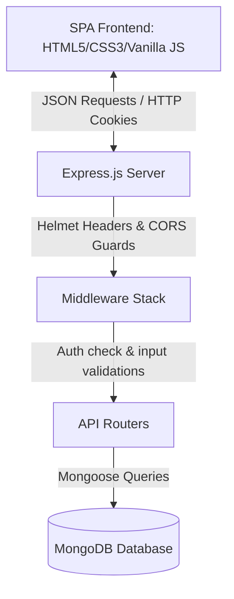
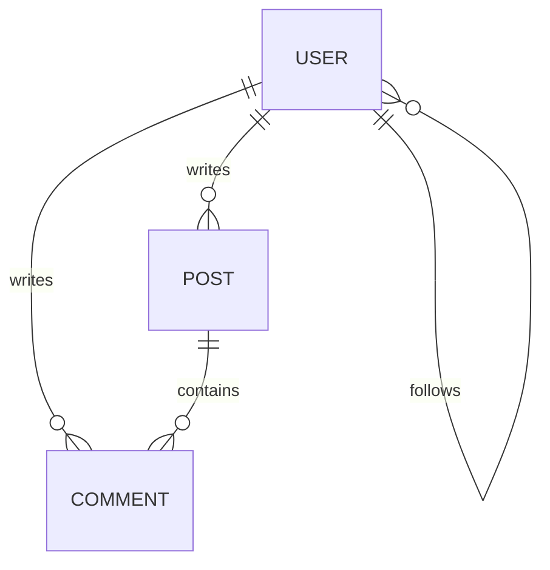

<div align="center">

# ✨ Nocturne

### *A Premium, High-Fidelity Glassmorphic Social Media Experience*

[](https://nodejs.org/)
[](https://expressjs.com/)
[](https://www.mongodb.com/)
[](https://developer.mozilla.org/en-US/docs/Web/JavaScript)
[](https://developer.mozilla.org/en-US/docs/Web/CSS)
[](https://jwt.io/)

<p align="center">
  Nocturne is an immersive, dark-themed micro-social media platform built from the ground up. It merges a highly refined glassmorphic design system with modern security paradigms.
</p>

[✨ Try Seeding Data](#-onboarding--database-seeding) • [🧭 API Route Explorer](#-api-endpoint-reference) • [🛠️ Setup & Dev](#-installation--setup)

---
</div>

## 🎨 Visual System & Branding

Nocturne's visual identity centers around **obsidian primary canvas themes** (`#0f0f17`), frosted glass panels, and glowing indigo interactive accents.

- **Geometry & Curves:** Follows an 8px base grid system with smooth corners ranging from `4px` tags to `16px` post cards and circular avatars.
- **Glassmorphic Elevations:** Built using progressive backdrop filters (`blur(12px)` to `blur(24px)`) and translucent `1px` white borders instead of heavy box shadows, maintaining a clean floating appearance.
- **Typography Pairing:** Premium typography using **Outfit** (for headings, usernames, and buttons) and **Inter** (for body copy, inputs, and timelines).

---

## ⚡ Key Technical Features

*   **Secure Authentication & Session Management:** Signed JSON Web Tokens (JWT) stored exclusively in `httpOnly` secure cookies. Uses `SameSite=Strict` and browser origin-locking to mitigate XSS and CSRF exposure.
*   **Real-Time Cascading Deletions:** Post deletion automatically purges all child comment records, preventing orphan data blocks.
*   **Idempotent Likes & Follows:** Prevents double-liking or duplicate following records at the MongoDB query layer using atomic operations (`$addToSet` and `$pull`).
*   **Adaptive Mobile Scaling:** Custom responsive design targeting everything from desktop monitors to narrow mobile phones (`≤400px`) featuring collapsible sidebars, bottom nav-bars, and touch-optimized action elements.
*   **Resilient Link Validation:** Employs programmatic `new URL()` constructors inside Express route validators to cleanly accept all standard URL characters, query strings, and seed strings.

---

## 🛠️ Project Architecture & Data Models

### System Flow Diagram



### Database Schema Relationships



- **User Model:** Stores usernames, emails, hashed passwords (via `bcryptjs`), bios, avatar URLs, and arrays of object references for `followers` and `following`.
- **Post Model:** Stores text contents, optional image URLs, a user reference `authorId`, likes array, and automatic creation timestamps.
- **Comment Model:** Binds a user reference `authorId`, post reference `postId`, content (max 500 chars), and creation timestamps.

---

## 🧭 API Endpoint Reference

All API routes consume and return JSON payloads. Authentication is handled by verifying a valid JWT stored in a `token` cookie.

| HTTP Method | Endpoint | Auth Required | Description |
| :--- | :--- | :---: | :--- |
| **POST** | `/api/auth/register` | No | Registers new user, hashes password, sets secure cookie. |
| **POST** | `/api/auth/login` | No | Authenticates credentials, issues JWT cookie. |
| **POST** | `/api/auth/logout` | No | Clears the `token` cookie. |
| **GET** | `/api/auth/me` | **Yes** | Returns authenticated profile data. |
| **GET** | `/api/users` | No | Returns creators list (Explore timeline), paginated. |
| **GET** | `/api/users/:username` | No | Returns user bio details, follower stats, and user posts. |
| **PATCH** | `/api/users/me` | **Yes** | Updates user bio and avatar URL. |
| **POST** | `/api/users/:id/follow` | **Yes** | Follows a user (idempotent). |
| **POST** | `/api/users/:id/unfollow` | **Yes** | Unfollows a user. |
| **POST** | `/api/posts` | **Yes** | Creates a text post with optional image. |
| **GET** | `/api/posts` | No | Fetches public post timeline, paginated. |
| **GET** | `/api/posts/:id` | No | Returns single post detail and full comment thread. |
| **DELETE** | `/api/posts/:id` | **Yes** | Deletes a post (enforces authorship ownership). |
| **POST** | `/api/posts/:id/like` | **Yes** | Toggles like status of a post. |
| **POST** | `/api/posts/:id/comments` | **Yes** | Creates a comment on a post. |
| **GET** | `/api/posts/:id/comments` | No | Fetches comment feed for a post. |
| **DELETE** | `/api/comments/:id` | **Yes** | Deletes a comment (enforces authorship ownership). |
| **GET** | `/api/feed` | **Yes** | Fetches feed from followed creators. |

<details>
<summary><b>🔍 View Sample API Payloads</b></summary>

### Register a User (`POST /api/auth/register`)
**Request:**
```json
{
  "username": "zephyr",
  "email": "zephyr@nocturne.app",
  "password": "password123"
}
```
**Response (201 Created):**
```json
{
  "success": true,
  "user": {
    "id": "60d0fe4f5311236168a109a1",
    "username": "zephyr",
    "email": "zephyr@nocturne.app"
  }
}
```

### Create a Post (`POST /api/posts`)
**Request:**
```json
{
  "content": "Chasing shadows in the cyberpunk alleyways of Tokyo. 🗼✨",
  "imageUrl": "https://images.unsplash.com/photo-1503899036084-c55cdd92da26"
}
```
**Response (201 Created):**
```json
{
  "success": true,
  "post": {
    "_id": "60d0fe4f5311236168a109b4",
    "authorId": {
      "_id": "60d0fe4f5311236168a109a1",
      "username": "zephyr"
    },
    "content": "Chasing shadows in the cyberpunk alleyways of Tokyo. 🗼✨",
    "imageUrl": "https://images.unsplash.com/photo-1503899036084-c55cdd92da26",
    "likes": [],
    "createdAt": "2026-05-28T12:00:00.000Z"
  }
}
```
</details>

---

## ⚡ Installation & Setup

### 1. Prerequisites
- **Node.js** (v16.x or higher)
- **MongoDB** (local database daemon or remote MongoDB Atlas cluster)

### 2. Dependency Setup
Clone the repository and run the package installer:
```bash
npm install
```

### 3. Environment Variables
Create a `.env` file in the root directory by duplicating `.env.example`:
```bash
cp .env.example .env
```
Populate the configuration details:
```env
PORT=5000
MONGODB_URI=mongodb://127.0.0.1:27017/nocturne_social
JWT_SECRET=generate_a_secure_jwt_secret_here
CLIENT_URL=http://localhost:3000
NODE_ENV=development
```

---

## 🧪 Onboarding & Database Seeding

Nocturne includes a pre-packaged seeding script that populates the database with default creators, follow relationships, posts, and interactive likes/comments.

To initialize your database with high-quality mock data:
```bash
npm run seed
```

### Seed User Logins
All seeded users share the password: `password123`
- `aurora@nocturne.app` (username: `aurora`)
- `orion@nocturne.app` (username: `orion`)
- `nova@nocturne.app` (username: `nova`)
- `zephyr@nocturne.app` (username: `zephyr`)

---

## 🚀 Running the Platform

### Development Mode (Recommended)
This boots up the Nodemon-watched Express backend alongside the live-reloaded static SPA frontend client:
```bash
npm run dev
```
- **Backend API:** Runs on `http://localhost:5000`
- **Frontend App:** Boots up on `http://localhost:3000`

### Production Mode
Run the optimized production daemon:
```bash
npm start
```
By default, the server will serve client assets statically from `/public` directly on the configured API port (e.g. `http://localhost:5000`).

---

## 🛡️ Security & Resiliency Verification

When deploying or contributing, verify these criteria:
1. **CSP Compliance:** Ensure scripts loaded from external CDNs fail unless whitelisted in `server.js` Helmet initialization.
2. **SameSite Check:** Inspect the cookies in the Chrome DevTools network tab. The `token` cookie must possess the `HttpOnly`, `Secure` (in production), and `SameSite=Strict` attributes.
3. **Database Cascade:** Delete a test post with comments and verify the associated elements are deleted using:
   ```js
   db.comments.find({ postId: deletedPostId }) // Expected: zero results
   ```
4. **Resilient URL Handling:** Attempt updating your profile avatar with complex query strings (e.g. `https://api.dicebear.com/7.x/adventurer/svg?seed=aurora&background=transparent`). Verify that the request registers a successful `200 OK` return.
